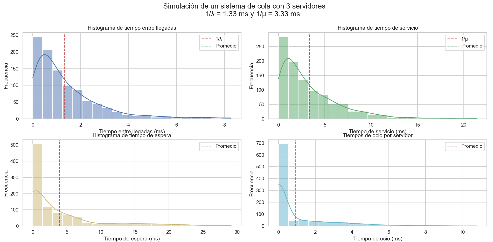
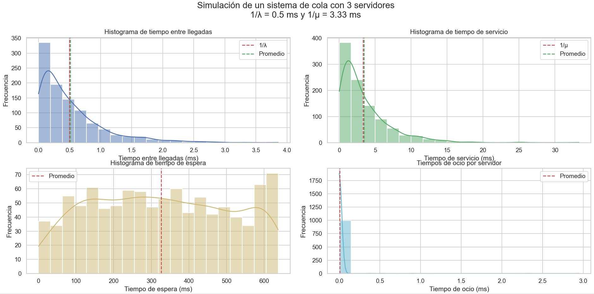

# Simulación de un sistema de colas

Sistema realizado para proyecto final, catedrea de Simulación, Ingeniería en Sistemas, Universidad Tecnológica Nacional, Facultad Regional Mendoza.

## Integrantes

- [Ignacio Berridy]( )
- [Ignacio Olcoz]( )
- [Cristian Rosales]( )

## Objetivo

El objetivo de este proyecto es simular un sistema de colas para la recepción de solicitudes de un servidor. En este caso se modela M/M/3, es decir, un sistema de colas con una tasa de llegada exponencial, una tasa de servicio exponencial y 3 servidores. 

Adicionalmente se ha desarrollador tanto el generador de números pseudoaleatorios, las pruebas de aleatoriedad y el generador de variables aleatorias con distribución exponencial.

## Desarrollo

Para el desarrollo de este proyecto se ha utilizado el lenguaje de programación Python, con las librerías numpy, matplotlib, seaborn y pandas.


## Ejecución

Primero se debe instalar las dependencias necesarias, para ello se debe ejecutar el siguiente comando:

```bash
pip install -r requirements.txt
```

Luego se debe ejecutar el archivo main.py, para ello se debe ejecutar el siguiente comando:

```bash
python main.py
```

Una vez que se ha ejecutado el programa, el programa pedirá al usuario que seleccione el tipo de generador de números pseudoaleatorios que desea utilizar.

## Resultados

El prrama generará gráficos con los resultados obtenidos, permitiendo al usuario visualizar el comportamiento del sistema de colas.

### 1 . Tiempo entre llegadas 1/λ 10ms y tiempo de servicio 1/μ 3.33ms

(Sistema subutilizado)

En este caso podemos observar que los servidores se encuentran desocupados la mayor parte del tiempo, lo que indica que el sistema no está siendo utilizado al máximo de su capacidad.

En este caso el porcentaje de uso de cada servidor fue de 
* Servidor 1: 10.11%
* Servidor 2: 12.77%
* Servidor 3: 11.46%

El tiempo promedio de espera en la cola fue de 0.0007 ms

El tiempo promedio del servicio fue de 3.39 ms


### 2 . Tiempo entre llegadas 1/λ 1.33ms y tiempo de servicio 1/μ 3.33ms

(Sistema equilibrado)

En este caso podemos observar que los servidores se encuentran ocupados la mayor parte del tiempo, lo que indica que el sistema está siendo utilizado al máximo de su capacidad. Además se puede observar que los tiempos de espera en la cola no son significativos. Por lo que se puede concluir que el sistema está siendo utilizado de manera eficiente.

En este caso el porcentaje de uso de cada servidor fue de
* Servidor 1: 77.60%
* Servidor 2: 77.78%
* Servidor 3: 79.59%

El tiempo promedio de espera en la cola fue de 3.92 ms

El tiempo promedio del servicio fue de 3.27 ms



### 3 . Tiempo entre llegadas 1/λ 0.5ms y tiempo de servicio 1/μ 3.33ms

(Sistema sobrecargado)

En este caso podemos observar que los servidores se encuentran ocupados la mayor parte del tiempo, lo que indica que el sistema está siendo utilizado al máximo de su capacidad. Además se puede observar que los tiempos de espera en la cola son significativos. 

En este caso el porcentaje de uso de cada servidor fue de

* Servidor 1: 99.76%
* Servidor 2: 99.69%
* Servidor 3: 99.92%

El tiempo promedio de espera en la cola fue de 326.25 ms

El tiempo promedio del servicio fue de 3.44 ms




